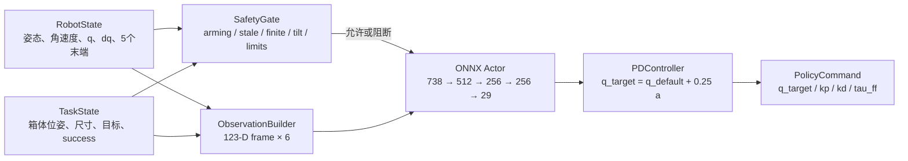
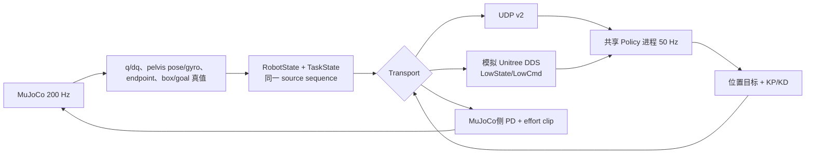
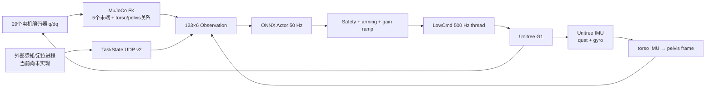

# PhysHSI CarryBox Deploy：Sim2Sim / Sim2Real 完整中文审查报告

> 审查日期：2026-07-30  
> 审查范围：当前工作区 `deploy/` 的源码、配置、模型 manifest、测试与已有验证日志，并对照 Isaac Gym 训练环境 `carrybox.py`、训练配置和 `rsl_rl` actor 实现。  
> 边界：本报告是代码与现有证据审查，不等价于目标 Unitree G1 上的硬件实测，也不把单元测试通过解释为任务级 sim2sim 或 sim2real 成功。

---

## 1. 执行摘要

### 1.1 一句话结论

当前 `deploy` 已经实现了一个结构完整、接口约束严格的 **CarryBox policy 部署框架**：它能从 Isaac Gym/RSL-RL checkpoint 中提取确定性 actor，构造与训练端同顺序的 `123 × 6 = 738` 维 observation，通过 ONNX 推理生成 29 维关节位置残差，并同时支持 MuJoCo sim2sim 与 Unitree DDS sim2real dry-run。

但它目前只能证明：

1. 模型、observation、action、关节映射、通信和安全接口在已有测试条件下工作；
2. ONNX 与 PyTorch actor 数值一致；
3. MuJoCo 运行链路能进入闭环。

它**不能证明**：

1. 当前本地训练 policy 已经完成四阶段搬箱任务的跨仿真迁移；
2. 真机需要的箱体/目标感知与全局定位已经实现；
3. torso IMU、29 电机映射、执行器动态和硬件安全参数已经在目标 G1 上校准；
4. sim2real 可以安全解除 dry-run 并发送有效刚度命令。

### 1.2 当前状态分级

| 层级 | 当前结论 | 证据 |
|---|---|---|
| 模型导出 | 通过 | 三个 manifest 均记录 `738→512→256→256→29` 确定性 actor；PyTorch/ONNX 最大误差为 `2.86e-6` 或 `3.81e-6` |
| 单元/集成接口 | 通过 | 2026-07-30 本地执行 `23 passed in 5.47s` |
| Observation 契约 | 代码上实现完整，golden Isaac 实机快照仍需补全 | 部署 builder 与 Isaac 代码顺序一致；已有 snapshot comparator，但 README 明确要求在 Isaac Gym 主机上产生 golden snapshot |
| MuJoCo 链路 | 能闭环、能记录、能严格检查 | 200 Hz server、50 Hz policy、四步 action hold、同步 sequence、终止和接触日志均已实现 |
| 当前 `model_55500` 严格 sim2sim | **失败** | 20 s 报告中约 11.415 s 触发 roll termination；policy 统计 39.57 Hz；存在 254 个非四步 sequence delta |
| Sim2real dry-run | 框架已实现 | 能接收 `LowState`、执行 ONNX、构造 observation；默认不写 `LowCmd` |
| 真机闭环 | **未完成/未验证** | 实际感知和全局定位未实现；默认 `dry_run=true`、`hardware_kp_scale=0.0`；IMU frame 与 motor mapping 待目标机确认 |

### 1.3 最重要的工程判断

- **“obs 一样”不等于“状态来源一样”。** Isaac Gym 的 observation 主要来自 PhysX GPU tensor 真值；sim2sim 来自 MuJoCo 真值；sim2real 来自编码器、IMU、MuJoCo FK 和外部感知。三者可以做到同维度、同顺序、同坐标系，但噪声、延迟、柔性、漂移和接触信息质量完全不同。
- **部署的是 actor，不是完整 PPO/AMP 系统。** critic、privileged observation、AMP discriminator、训练时高斯采样和 optimizer 都没有进入部署。
- **sim2sim 的主要价值是检查接口和跨物理引擎鲁棒性，不是复刻 Isaac Gym。** MuJoCo 与 PhysX 的接触求解、摩擦、关节限位、碰撞 margin、reset 分布不同；当前场景也没有覆盖训练中的全部 phase、AMP motion state 与随机化。
- **sim2real 当前最先可能出问题的不是 ONNX，而是状态同步与硬件语义。** 最高风险依次是：任务感知缺失/延迟、IMU frame 和四元数约定、电机索引/方向、执行器与刚体模型失配、接触差异以及缺少硬件级热流限制。

---

## 2. 审查依据与目录职责

### 2.1 主要证据

- 训练 observation/action：`legged_gym/legged_gym/envs/g1/carrybox.py:129-154, 230-253, 712-802, 945-970, 1202-1230`
- 训练维度、增益、随机化与物理频率：`legged_gym/legged_gym/envs/g1/carrybox_config.py:4-25, 97-140, 227-266, 359-375, 397-414`
- Actor 网络与确定性推理：`rsl_rl/rsl_rl/modules/actor_critic.py:92-145, 178-191`
- Deploy 配置：`deploy/config/g1_carrybox.yaml`
- Deploy observation：`deploy/common/observation.py:23-131`
- Deploy policy core：`deploy/policy/core.py:24-132`
- Sim2sim：`deploy/sim2sim/mujoco_server.py`
- Sim2real：`deploy/sim2real/unitree_backend.py`
- 模型导出：`deploy/tools/export_actor.py`
- 现有验证：`tests/test_deploy_core.py`、`tests/test_deploy_tools.py` 和 `deploy/validation_reports/`

### 2.2 `deploy` 目录职责地图

| 目录/文件 | 作用 | 是否进入在线控制闭环 |
|---|---|---:|
| `config/g1_carrybox.yaml` | 模型 profile、robot、频率、场景、网络和安全参数的单一配置入口 | 是 |
| `common/constants.py` | 29 关节顺序、五个 endpoint、默认姿态、KP/KD、obs slice | 是 |
| `common/types.py` | `RobotState`、`TaskState`、`PolicyCommand` 类型边界 | 是 |
| `common/observation.py` | 123-D 单帧和 738-D history 构造 | 是 |
| `common/control.py` | actor action 到 PD 位置目标与 torque 的转换 | 是 |
| `common/safety.py` | 状态时效、有限性、四元数、倾斜、关节限位和 dry-run 门控 | 是 |
| `common/transport.py` | UDP v2 二进制编解码与 latest-only receiver | 是 |
| `common/kinematics.py` | MuJoCo 名称映射、真值读取和真机端 FK | 是 |
| `common/mapping.py` | URDF 关节/限位读取和 motor permutation 校验 | 启动时/在线 |
| `policy/inference.py` | ONNX Runtime 严格输入输出检查 | 是 |
| `policy/core.py` | observation→actor→command 的后端无关核心 | 是 |
| `policy/run.py` | 进程入口、backend 选择、调度、arming、安全和日志 | 是 |
| `sim2sim/mujoco_server.py` | MuJoCo 物理、任务状态、PD torque、接触和终止 | 是 |
| `sim2sim/unitree_bridge.py` | 在 MuJoCo 中模拟 `LowState/LowCmd` DDS 话题 | DDS sim2sim 时 |
| `sim2real/unitree_backend.py` | Unitree `LowState` 读取、FK、IMU转换与 `LowCmd` 写线程 | sim2real 时 |
| `sim2real/task_provider.py` | 外部 task-state provider 接口与 UDP 实现 | 是 |
| `sim2real/mock_task.py` | dry-run 的固定箱体/目标假数据 | 仅测试 |
| `tools/build_mjcf.py` | URDF→浮动基座 MJCF、执行器、IMU、D455 相机构建 | 离线 |
| `tools/export_actor.py` | checkpoint→ONNX+manifest | 离线 |
| `tools/preflight.py` | 依赖、接口、端口、模型、频率和安全锁检查 | 启动前 |
| `tools/validate_sim2sim.py` / `run_udp_smoke.py` | 自动启动双进程并严格检查日志 | 验证 |
| `tools/compare_observation_snapshot.py` | 使用原始 Isaac 状态独立重建并比对 observation | 验证 |
| `models/*.onnx` / `*.manifest.json` | actor 二进制和不可混淆的接口/身份描述 | 是 |
| `assets/*.xml` | MuJoCo 场景与生成的机器人 MJCF | sim2sim/FK |
| `validation_reports/` | 已有 sim2sim 证据 | 否 |

缓存 `__pycache__` 不属于设计；ONNX 二进制不逐层反编译，而是通过 checkpoint key/shape、manifest 和 ONNX Runtime parity 进行审查。

---

## 3. 总体架构

### 3.1 共享 policy 核心



`PolicyCore` 不知道状态来自 MuJoCo 还是 G1。两个 backend 的核心职责是把不同来源的数据转换为同一个 `RobotState + TaskState` 契约，再把 `PolicyCommand` 发送给仿真器或硬件。这是当前实现最合理的结构性设计。

对应源码：

- 类型契约：`deploy/common/types.py:19-131`
- observation：`deploy/common/observation.py:89-122`
- actor 和 fail-closed：`deploy/policy/core.py:46-132`
- action/PD：`deploy/common/control.py:39-124`

### 3.2 Sim2sim 数据流



### 3.3 Sim2real 数据流



感知、状态估计、学习策略和低层控制并不是四个互不相关的模块。对于这个 policy，外部感知必须输出 **pelvis-relative** 的箱体/目标状态；因此它必须与 IMU/机器人姿态估计共享时间基准和 frame 约定，否则网络输入虽然仍为 738 维，语义却已经错误。

---

## 4. 公共接口与运行契约

### 4.1 `RobotState`

`RobotState` 定义于 `deploy/common/types.py:19-63`：

| 字段 | 形状 | 语义 |
|---|---:|---|
| `sequence` | 标量 | 来源状态序号 |
| `timestamp_ns` | 标量 | 单调时钟时间戳 |
| `policy_frame_quat_wxyz` | 4 | policy frame 在世界中的姿态，WXYZ |
| `policy_frame_ang_vel` | 3 | policy frame 表达的角速度，rad/s |
| `joint_pos` | 29 | policy 关节顺序的关节位置，rad |
| `joint_vel` | 29 | policy 关节顺序的关节速度，rad/s |
| `end_effector_pos_policy_frame` | 5×3 | 五个 endpoint 相对 pelvis/root 原点并旋转到 pelvis frame 的位置，m |

这里的 policy frame 固定为 `pelvis`。五个 endpoint 的固定顺序是左掌、右掌、左 ankle-pitch、右 ankle-pitch、`mid360_link`，见 `deploy/common/constants.py:37-43`。

### 4.2 `TaskState`

`TaskState` 定义于 `deploy/common/types.py:66-97`：

| 字段 | 形状 | 语义 |
|---|---:|---|
| `box_pos_policy_frame` | 3 | 箱体中心相对 pelvis 的位置，m |
| `box_quat_policy_frame_wxyz` | 4 | 箱体相对 pelvis 的四元数，WXYZ |
| `box_size` | 3 | 箱体 X/Y/Z 尺寸，m |
| `goal_pos_policy_frame` | 3 | 目标相对 pelvis 的位置，m |
| `success` | bool | 成功后将整段 15-D task observation 置为 `-1` |

`LowState` 本身不包含这些 task 信号；sim2real 必须由独立感知/定位进程提供。

### 4.3 `PolicyCommand`

`PolicyCommand` 定义于 `deploy/common/types.py:100-131`，包含 29 维 `raw_action`、`q_target`、`kp`、`kd`、`tau_ff`，并带 `armed`、`reason`、sequence 和时间戳。

### 4.4 网络协议与 DDS

- UDP 协议版本固定为 v2，版本不匹配会被拒绝：`deploy/common/transport.py:16-39`。
- UDP 分别编码 `RobotState`、`TaskState`、`PolicyCommand`：`deploy/common/transport.py:47-139`。
- Sim2sim UDP 使用三个端口：robot state `15000`、task state `15001`、command `15002`。
- Unitree DDS 使用：
  - `rt/lowstate`：机器人→policy；
  - `rt/lowcmd`：policy→机器人/仿真 bridge。
- DDS sim2sim 中 task state 仍走 UDP，因为 Unitree 标准 `LowState` 没有任务目标信息。

---

## 5. Deploy Policy 是如何实现的

### 5.1 训练端 actor

RSL-RL 的 `ActorCritic` 同时包含 actor、critic 和可学习动作标准差。训练时 `act()` 从高斯分布采样，部署对应的 `act_inference()` 只返回 actor 均值，见：

- 网络构造：`rsl_rl/rsl_rl/modules/actor_critic.py:92-145`
- 训练采样：`rsl_rl/rsl_rl/modules/actor_critic.py:178-184`
- 确定性推理：`rsl_rl/rsl_rl/modules/actor_critic.py:189-191`

CarryBox 继承的网络配置是：

```text
actor_obs 738
  → Linear(738, 512) + ELU
  → Linear(512, 256) + ELU
  → Linear(256, 256) + ELU
  → Linear(256, 29)
```

配置来源：`legged_gym/legged_gym/envs/base/legged_robot_config.py:334-341`。

### 5.2 从 checkpoint 提取 actor

checkpoint 不是可以直接调用的独立模型，而是包含 `model_state_dict` 的训练快照。导出器：

1. 要求存在八个 actor 参数 key；
2. 校验每层 weight/bias 的精确 shape；
3. 只加载 `actor.0/2/4/6`；
4. 不加载 critic、`std`、AMP、optimizer 或训练状态；
5. 将 actor 设为 eval；
6. 以 opset 17 导出 ONNX，输入名 `actor_obs`，输出名 `actions`；
7. 用固定随机样本比较 PyTorch 和 ONNX Runtime，误差必须 `<1e-5`。

对应源码：`deploy/tools/export_actor.py:30-99, 102-194`。

### 5.3 Manifest 防止模型与接口混用

每个 profile 独立保存：

- checkpoint 和 ONNX 路径/hash；
- profile；
- policy frame；
- UDP protocol version；
- 输入/输出名称、dtype、shape；
- observation slice、关节名、endpoint 名；
- action scale、physics/policy 频率；
- ONNX parity error。

启动时 `validate_model_manifest()` 会重新计算 ONNX 和 checkpoint SHA256，并检查 frame、频率、action scale 与 profile，见 `deploy/common/model_manifest.py:44-105`。因此把 `model_73500.onnx` 错配给 `model_55500.manifest.json` 会在运行前失败。

当前三个模型：

| Profile | ONNX parity 最大绝对误差 |
|---|---:|
| `official_carrybox_65000` | `2.86102294921875e-6` |
| `model_55500` | `3.814697265625e-6` |
| `model_73500` | `2.86102294921875e-6` |

这些值说明**网络导出数值一致**，不说明 observation 或物理轨迹一致。

### 5.4 在线推理和 fail-closed

`OnnxActor` 强制：

- 只有一个名为 `actor_obs` 的输入；
- 只有一个名为 `actions` 的输出；
- 输入为 `(batch, 738)`；
- 输出为 `(batch, 29)`；
- 输出必须全部有限。

见 `deploy/policy/inference.py:12-41`。

`PolicyCore.step()` 的顺序是：

1. 构造并追加最新 observation；
2. 运行 ONNX；
3. 检查 shape、NaN/Inf 和推理耗时；
4. 在允许时更新 `previous_action`；
5. 生成 policy command；
6. 任何异常都退回当前位置、零 KP、保留 KD 的 damping hold。

见 `deploy/policy/core.py:46-132`。

### 5.5 Action 的真实含义

actor 输出不是 torque，也不是绝对关节角，而是默认姿态上的位置残差：

\[
\mathbf{a}_{clip}=\mathrm{clip}(\mathbf{a},-100,100)
\]

\[
\mathbf{q}_{target}=\mathbf{q}_{default}+0.25\mathbf{a}_{clip}
\]

训练端公式在 `carrybox.py:1215-1224`；部署端在 `deploy/common/control.py:39-51`。

PD torque 为：

\[
\boldsymbol{\tau}
=
\boldsymbol{\tau}_{ff}
+\mathbf{K}_p(\mathbf{q}_{target}-\mathbf{q})
-\mathbf{K}_d\dot{\mathbf{q}}
\]

MuJoCo 端再根据 URDF effort limit 对 torque clip，见 `deploy/sim2sim/mujoco_server.py:589-601`。

#### Sim2sim 与 Sim2real action 处理差异

| 项目 | Sim2sim | Sim2real |
|---|---|---|
| Actor 输出 | 同一 ONNX 29-D | 同一 ONNX 29-D |
| `q_target` | 默认不按 joint limit clamp，以保持训练 parity | 按 URDF joint limits clamp |
| KP/KD | 训练配置原值 | `hardware_kp_scale × gain_ramp` 和 `hardware_kd_scale` |
| torque 计算 | MuJoCo server 内显式计算并按 effort clip | G1 电机低层根据 `q/kp/kd/tau` 执行 |
| 命令频率 | policy target 每 4 个 200 Hz physics step 更新 | policy 50 Hz，最近目标由 500 Hz command thread 重发 |
| stale fallback | 仿真暂停/阻尼 hold | 500 Hz 线程替换为当前位置、零 KP、KD damping hold |

需要特别注意：sim2real 代码并没有在 PC 侧得到“真实输出 torque”并按 URDF effort limit 闭环裁剪。它发送位置、KP、KD 和 feedforward torque；最终电流/力矩限制依赖 Unitree 低层与硬件配置。这是必须通过硬件接口确认的边界。

---

## 6. Isaac Gym 与 Deploy Observation 的区别和联系

### 6.1 精确维度

训练配置：

- proprio：`6 + 29×2 + 29 + 5×3 = 108`
- task：`15`
- 单帧：`108 + 15 = 123`
- history：`6`
- actor observation：`123×6 = 738`
- action：`29`

来源：`carrybox_config.py:8-25`；deploy 常量：`deploy/common/constants.py:45-60`。

维度复核：

```text
3 + 3 + 29 + 29 + 15 + 29 + 15 = 123
123 × 6 = 738
```

### 6.2 单帧逐维对照

索引均采用 Python 左闭右开 `[start:end)`。

| Slice | 索引 | 维数 | Isaac Gym 计算 | Deploy 计算 | 单位/缩放 |
|---|---:|---:|---|---|---|
| pelvis angular velocity | `[0:3)` | 3 | PhysX rigid-body world gyro，经 pelvis quat 逆旋转 | sim2sim 用 MuJoCo body angular velocity；sim2real 用 IMU gyro 或 torso→pelvis转换 | rad/s × `0.25` |
| projected gravity | `[3:6)` | 3 | `quat_rotate_inverse(pelvis_quat, [0,0,-1])` | 同公式，WXYZ helper | 无量纲 |
| joint position | `[6:35)` | 29 | `dof_pos-default_dof_pos` | 同关节顺序、同 default | rad × `1.0` |
| joint velocity | `[35:64)` | 29 | `dof_vel` | 同关节顺序 | rad/s × `0.05` |
| endpoint position | `[64:79)` | 15 | 两掌、两 ankle-pitch、头部；减 root position 后转入 pelvis | sim2sim 由 MuJoCo body pose；sim2real 由 29 q 做刚体 FK | m |
| previous action | `[79:108)` | 29 | `self.actions`，即上一个 policy step 的 raw actor action | builder 中保存上次有限 actor 输出 | 原始网络输出 |
| task | `[108:123)` | 15 | box pos 3 + box rotation 6D + size 3 + goal pos 3 | 同语义；success 时全部为 `-1` | m/无量纲 |

Deploy 切片定义：`deploy/common/constants.py:52-60`；构造：`deploy/common/observation.py:74-111`。

### 6.3 Task observation 的 15 维

顺序为：

1. 箱体中心相对 pelvis 的位置：3；
2. 箱体相对 pelvis 旋转后的局部 X 轴与局部 Z 轴：6；
3. 箱体尺寸：3；
4. 目标相对 pelvis 的位置：3。

旋转 6D 不是欧拉角，也不是四元数截断，而是将箱体局部 X 和 Z 两个单位轴旋转到 pelvis frame 后拼接，见：

- Isaac：`carrybox.py:712-722`
- Deploy：`deploy/common/math_utils.py:61-67`

成功时 actor 看到 15 个 `-1`，见 `carrybox.py:750` 和 `deploy/common/observation.py:74-87`。因此外部感知不能随意把“目标不可见”也编码为全 `-1`，否则会与训练中的 success 语义冲突。

### 6.4 六帧 history 的时序

Isaac Gym：

```python
actor_history_obs = cat(
    old_obs[:, 123:],
    current_proprio,
    current_task
)
```

即删除最老帧，在尾部追加最新帧，顺序始终是 **oldest→newest**，见 `carrybox.py:796-802`。

Deploy 使用形状 `(6,123)` 的 `_history`：

1. `_history[:-1] = _history[1:]`
2. `_history[-1] = frame`
3. reshape 为 `(1,738)`

见 `deploy/common/observation.py:113-122`。

#### Reset 语义

- Isaac env reset：`obs_buf[env_ids]=0`，见 `carrybox.py:380-384`。
- Deploy：
  - operator 从未 armed→armed 时清 history；
  - state sequence 真回退时清 history；
  - 重复 sequence 只跳过，不清 history；
  - disarmed 时不更新 previous action。

sequence 分类在 `deploy/policy/run.py:49-56`，reset/调度在 `deploy/policy/run.py:303-320`。

这个设计避免 UDP 重传或 latest-only 轮询把重复包误判为环境 reset。

### 6.5 脚踝 endpoint 的一帧延迟

这是一个非常关键且不直观的兼容细节。

Isaac Gym 在 `post_physics_step()` 中：

1. 先用当前 `self.feet_pos` 构造 `end_effector_pos`；
2. 随后才从最新 rigid-body tensor 更新 `self.feet_pos`。

代码顺序见 `carrybox.py:244-258`。因此两只 ankle-pitch 在 actor observation 中实际滞后一个 policy step，而双手和头使用当前刚体状态。

Deploy 默认 `legacy_ankle_delay_steps=1`，在构造当前帧时用 `_previous_endpoints[2:4]` 替换两只脚踝，见 `deploy/common/observation.py:89-93`。这不是理想传感器设计，而是为了匹配已经训练好的 actor 输入分布。

风险：

- 如果未来修复训练端更新顺序但继续使用旧 checkpoint，不能直接关闭部署 delay；
- 新 checkpoint 和 deploy profile 必须共同声明此兼容开关；
- 当前 manifest 没有记录 `legacy_ankle_delay_steps`，它只在 YAML 中，模型与此时序语义仍存在人为错配风险。

### 6.6 Previous action 的联系

训练端 `self.actions` 是本次 `step(actions)` 接收并 clip 后的 action；在随后的 observation 构造中，它成为“上一 policy step 的 action”。Deploy 在成功推理后调用 `set_previous_action(raw_action)`，下一帧才使用它，语义一致。

注意：

- observation 中保存的是 raw actor action，不是 `0.25×action`，也不是 `q_target`；
- action 会先按 observation clip 范围 `[-100,100]` 保存；
- dry-run 虽然阻止硬件写入，但仍运行推理并更新 action history，以便检查真实 inference trajectory；
- 普通安全阻断不会运行 actor，也不会推进有效 action history。

### 6.7 四元数和 frame

| 环境 | 原生四元数顺序 | Deploy 边界 |
|---|---|---|
| Isaac Gym tensor | XYZW | snapshot comparator 显式转 WXYZ |
| MuJoCo `xquat` | WXYZ | 直接进入 `RobotState` |
| Unitree `imu_state.quaternion` | 代码假设 WXYZ | 必须在目标 SDK/固件上确认 |

Deploy 的所有公共类型都要求 WXYZ，见 `deploy/common/types.py:21-25`。

位置平移采用 root/pelvis 原点，而旋转采用 `upper_body_index` 对应的 pelvis 姿态：

- Isaac endpoint：先减 `root_states[:3]`，再用 pelvis quat 逆旋转，见 `carrybox.py:244-250`；
- task position：先减 root position，再用 pelvis quat 逆旋转，见 `carrybox.py:712-720`；
- Deploy sim2sim 也以 `pelvis_body_id` 取平移原点，以 `policy_frame_body_id` 取旋转，见 `deploy/common/kinematics.py:88-106, 229-246`。

当前配置中 root body 与 policy frame 都是 pelvis，因此数值一致。若未来把 `policy_frame` 改为 torso，却仍以 pelvis/root 作为平移原点，语义会变成“torso朝向、pelvis原点”的混合 frame；当前代码和 checkpoint 不支持随意改 frame。

### 6.8 Isaac、MuJoCo、真机的数据来源差异

| Observation 内容 | Isaac Gym | MuJoCo sim2sim | Unitree sim2real |
|---|---|---|---|
| q/dq | PhysX DOF tensor 真值 | MuJoCo qpos/qvel 真值 | motor encoder `q/dq` |
| pelvis orientation | rigid-body tensor 真值 | `data.xquat[pelvis]` 真值 | IMU；若装在 torso 则经 FK转 pelvis |
| pelvis angular velocity | rigid-body tensor 真值 | `mj_objectVelocity` | IMU gyro，减相对腰部运动后换 frame |
| endpoint | rigid-body tensor真值 | body `xpos` 真值 | 仅由 q 和刚体模型做 FK |
| box/goal | simulator state 真值，可加任务噪声/遮挡逻辑 | simulator state 真值 | 外部感知/定位 UDP，尚未实现 |
| 时间同步 | 同一 physics step GPU tensor | robot/task 同 sequence | robot/task 仅分别做 timestamp freshness，未严格同源配对 |

### 6.9 训练噪声与部署噪声

训练配置 `add_noise=True`，proprio 噪声包括：

- angular velocity；
- gravity；
- q/dq；
- endpoint。

见 `carrybox_config.py:368-376`。

任务 observation 还实现：

- 远距离 coarse box pose；
- 可见性 mask；
- 位置噪声；
- 旋转噪声；
- goal 位置噪声。

见 `carrybox.py:724-746`。

Deploy 不再人为注入这些噪声，而是使用 backend 的真实/仿真状态。这有两个含义：

1. sim2sim 并不复现训练的 actor observation 分布，输入反而比训练更“干净”；
2. sim2real 的真实噪声并不天然等价于训练均匀噪声，尤其是感知 dropout、偏置、时延和系统性姿态误差。

因此“训练中加过噪声”不能替代对真实传感器误差模型的校准。

### 6.10 Actor 与 critic observation 边界

actor 只接收 738-D history。critic 每个当前帧还接收：

- base linear velocity privileged 3-D；
- task critic 真值；
- 17-D interaction privileged proxy，包括箱体速度、接触等。

训练配置的 critic 维数是 143，见 `carrybox_config.py:15-25`；critic 构造位于 `carrybox.py:804-970`。

部署只导出 actor，因此：

- 不需要估计 base linear velocity；
- 不需要直接测量手-箱接触力给 actor；
- AMP 和 privileged critic 只帮助训练，不是运行时依赖。

但这也意味着 actor 必须从 6 帧 q/dq、末端位置、姿态和任务状态中隐式判断动态与接触；当 history 时序抖动或真实接触行为偏离训练时，策略没有显式 contact state 可以纠正。

---

## 7. Sim2sim 的完整实现

### 7.1 URDF→MJCF

`build_mjcf.py`：

1. 从训练 URDF 按 29 个固定名称读取关节限位和 effort；
2. 添加 world→pelvis floating base；
3. 通过 MuJoCo 加载 URDF 并保存 MJCF；
4. 为每个关节创建同名 motor；
5. motor `ctrlrange` 使用 URDF effort limit；
6. 为关节设置 `armature=0.01`；
7. 保留 torso IMU 和 D455 camera frame；
8. 重新加载生成文件，检查 29 关节、29 actuator 和相机所属 body。

见 `deploy/tools/build_mjcf.py:56-120, 198-276`。

名称映射不是按 XML 顺序碰运气，而是启动时按关节/body/actuator 名称解析 qpos、qvel、endpoint 和 actuator id，见 `deploy/common/kinematics.py:30-80`。

### 7.2 物理配置

当前配置：

- `physics_dt=0.005 s`，即 200 Hz；
- policy 50 Hz；
- decimation 4；
- joint armature 0.01；
- collidable geom margin 0.01 m；
- free-base linear/angular damping 0.01；
- 关节限位设置显式 `solref/solimp`；
- torque 按 URDF effort limit clip。

MuJoCo 场景尽量匹配训练配置的数值，但它不是 PhysX TGS 的同一个求解器。训练端 PhysX 使用 8 position iterations、0 velocity iterations、contact offset 0.01、rest offset 0，见 `carrybox_config.py:397-414`。

### 7.3 Reset 与初始场景

MuJoCo reset：

- robot base：配置位置与四元数；
- q：训练 default pose；
- box：固定 `0.30×0.30×0.25 m`；
- source platform：固定尺寸与间隙；
- goal：固定位置；
- 初始保持 frozen，直到首个 armed command 到达。

实现见 `mujoco_server.py:401-446`。

这是一个确定性代表场景，不包含：

- 训练中的完整箱体高度采样；
- AMP motion-state initialization；
- phase-specific `loco/pickUp/carryWith/putDown` 状态；
- 全部 mass/COM/friction/restitution/domain randomization；
- 全任务 curriculum。

所以它适合接口 smoke test，不足以直接估计四阶段成功率。

### 7.4 UDP sim2sim

MuJoCo 每次 `_publish()` 从同一物理状态生成：

- `RobotState(sequence=s)`；
- `TaskState(sequence=s)`。

二者用同一 source sequence 发送，见 `mujoco_server.py:661-685`。

Policy 侧 `SequenceStatePair` 只有在 robot/task sequence 完全相等时才更新同步 pair，见 `deploy/policy/backends.py:15-40`。这避免把时刻 `s` 的机器人状态和时刻 `s+1` 的箱体状态拼成一个 observation。

### 7.5 DDS sim2sim

MuJoCo bridge 把：

- q/dq、pelvis quat/gyro 写到模拟 `LowState`；
- policy 的 `LowCmd` 转回 `PolicyCommand`；
- task state 仍通过 UDP 发布。

这条链路用于尽早暴露 Unitree SDK topic、message layout、CRC 和 mapping 问题。它仍不包含真实电机、真实网络抖动、IMU安装误差或 G1 内部控制器。

### 7.6 50 Hz/200 Hz 严格边界握手

策略不是简单地“每隔大约 20 ms 读一次 latest state”。为了保证 action 只在四步边界改变：

1. MuJoCo 在 boundary 发布 sequence `s`；
2. policy 用 `s` 的状态推理；
3. command 的 sequence 被改为来源状态 `s`；
4. server 等待对应 command；
5. 到达后将该 target 保持四个 5 ms physics step；
6. 下一个 policy boundary 应为 `s+4`。

见：

- policy 侧调度：`deploy/policy/run.py:303-388`
- MuJoCo boundary wait：`mujoco_server.py:603-659`
- 四步更新：`mujoco_server.py:687-704`

UDP 丢包时，server 会冻结 boundary 并每 2 ms 重发同 sequence、刷新 timestamp；重复包不会重新推理或清 history。等待超时则切到 damping hold 并停止 physics active 状态。

### 7.7 接触、终止与日志

Server 记录：

- q/dq、action、q_target、torque；
- projected gravity；
- task pose；
- contact body 与 contact force；
- joint-limit violation；
- active/pending command sequence；
- policy boundary wait；
- 训练风格终止原因。

Sim-parity 的失败会被 latch 并暂停，而不是先切零 KP 再让机器人因重力继续倒下。这使日志中的“首次失败”更接近 policy 导致的失败点。

### 7.8 严格验证器检查什么

`run_udp_smoke.py` 会检查：

- 日志存在且没有 NaN/Inf；
- warm-up 后每一步 safe/armed；
- policy 47.5–52.5 Hz；
- physics 190–210 Hz；
- inference p99 < 15 ms；
- history 不因重复包 reset；
- action 不在四步区间中改变；
- joint-limit 穿透不超过阈值；
- 没有 pelvis/torso/hip 异常触地；
- 没有训练终止；
- policy 消费的 sequence delta 必须为 4；
- 日志包含经过验证的模型身份。

主要检查逻辑见 `deploy/tools/run_udp_smoke.py:167-442`。

---

## 8. Sim2real 的完整实现

### 8.1 `LowState`→29 关节状态

`UnitreePolicyBackend`：

1. 初始化 DDS domain/interface；
2. 订阅 `rt/lowstate`；
3. 按 `policy_to_motor` 从 `motor_state` 读取 q/dq；
4. 用固定 policy 顺序形成 29-D joint state；
5. 用 q 计算五个 endpoint；
6. 读取 IMU quaternion 和 gyro；
7. 生成带单调时间戳的 `RobotState`。

见 `deploy/sim2real/unitree_backend.py:30-96, 98-145`。

当前 mapping 是 `[0,1,...,28]`。代码只验证它是 `0..28` 的 permutation，并不能证明：

- SDK motor index 与训练关节名顺序完全一致；
- 每个电机正方向一致；
- 关节零位一致；
- 不同 G1 固件/model revision 没有变化。

这些必须在真机上逐关节验证。

### 8.2 torso IMU→pelvis

训练 policy 使用 pelvis frame，但配置声明真实 IMU 位于 torso。

代码使用当前 q/dq 的刚体 FK 计算：

- pelvis→torso 相对四元数；
- 腰部关节造成的 torso 相对角速度。

然后执行：

1. 从 torso 世界姿态去掉 pelvis→torso 相对旋转，得到 pelvis 世界姿态；
2. 从 IMU gyro 中减去腰部相对运动；
3. 将角速度转到 pelvis frame。

见 `unitree_backend.py:107-126` 和 `deploy/common/kinematics.py:201-214`。

该方法成立的隐藏假设：

- IMU quaternion/gyro frame 与代码假设一致；
- quaternion 是 WXYZ；
- IMU安装外参已包含在 robot model 或 SDK定义中；
- 腰部 q/dq 足够准确且时间对齐；
- 刚体 FK 能描述 torso/pelvis关系；
- 没有显著结构柔性与传感器滤波相位差。

任一假设错误都会同时污染 angular velocity、projected gravity 和 task pose的 pelvis转换，属于高影响系统误差。

### 8.3 五个 endpoint 的真机构造

真机没有直接提供五个 rigid-body position。部署复用生成的 MuJoCo MJCF，根据 29 个 measured q 做 forward kinematics，见 `deploy/common/kinematics.py:143-214`。

它不依赖 base translation，因为 endpoint 最终是 pelvis-relative；但它忽略：

- link/关节柔性；
- 齿隙；
- 编码器零偏；
- 负载导致的结构变形；
- 真实机械尺寸与训练 URDF差异。

双手 endpoint 对搬箱接触尤其关键。若肩/肘/腕零偏只有几度，手相对箱体的位置误差可能已经足以改变接触模式。

### 8.4 Task state provider

Sim2real 通过 UDP latest receiver 获取 `TaskState`，见 `deploy/sim2real/task_provider.py:14-32`。

当前实现只定义了接口、UDP接收器和固定 mock publisher，没有实现：

- 箱体检测/6D pose；
- 箱体尺寸估计或先验绑定；
- 目标区域定位；
- robot/global localization；
- camera→pelvis 外参；
- 感知丢失、重定位和 confidence；
- 感知时间戳与 LowState 时间同步。

更重要的是，sim2sim UDP backend 强制 robot/task 同 sequence；sim2real backend 只是分别保存最新 robot 和最新 task，之后依赖 `max_*_state_age_ms` 检查 freshness，见 `unitree_backend.py:146-151`。因此两个状态可能都“不旧”，但实际相差几十毫秒。

对于移动、弯腰、快速伸手的全身任务，这种时差会让 pelvis-relative box pose 与使用的 pelvis姿态不属于同一时刻。当前接口应被视为**异步 latest-state 融合**，不是严格同步融合。

### 8.5 50 Hz policy 与 500 Hz command

Policy runner 在 sim2real 中按 50 Hz运行。最新 `PolicyCommand` 交给独立 500 Hz 线程，线程不断发送同一目标，直到下一个 policy output 到达，见：

- policy period：`deploy/policy/run.py:282-287`
- command thread：`unitree_backend.py:175-211`

如果 command 时间戳超过 `command_stale_timeout_ms=100 ms`：

- q_target 改为最近有限的当前 q；
- KP=0；
- KD 使用默认 damping；
- `armed=False`；
- reason 标记为 stale。

这个独立 watchdog 是必要的，因为 policy 主线程卡死时，500 Hz 发送线程仍能切换目标。

### 8.6 Gain ramp 与硬件写入互锁

Real command 需要同时满足：

1. 配置 `safety.dry_run=false`；
2. 启动参数包含 `--allow-hardware-command`。

否则 `write_enabled=false`。此外默认 YAML：

- `dry_run=true`
- `hardware_kp_scale=0.0`

dry-run config 工具和 preflight 会再次锁定并检查这两项，见：

- `deploy/tools/make_dryrun_config.py:48-70`
- `deploy/tools/preflight.py:250-256`
- `deploy/policy/run.py:199-210`

即使未来解除 dry-run，KP 也按 `gain_ramp_seconds=3.0` 从 0 渐入，见 `deploy/policy/run.py:346-379`。

### 8.7 SafetyGate

SafetyGate 依次检查：

- e-stop；
- operator armed；
- robot/task state 存在；
- robot/task state 时效；
- NaN/Inf；
- robot 和 task quaternion 范数；
- box size 正数；
- pelvis projected gravity XY；
- hardware-safe joint limit margin；
- dry-run。

见 `deploy/common/safety.py:55-171`。

任何 latch fault 会把 operator 设为 disarmed，需要显式重新 arm。Policy actor shape、NaN或推理超时在 `PolicyCore` 内再次 fail-closed。

#### 当前 SafetyGate 没有覆盖

- 电机温度；
- 电流/实际 torque；
- 电池状态；
- SDK mode machine 状态是否正确；
- 通信 packet loss rate 和连续 jitter；
- foot/hand contact force；
- base高度、头部高度和非预期身体触地；
- joint velocity/acceleration 上限；
- q_target 单步变化率/速度限制；
- actor action norm/rate limit；
- 外部感知 confidence；
- 人员/环境急停链路；
- 硬件级独立 fallback controller。

因此它是软件进程级第一道门，不是完整的真机 safety supervisor。

---

## 9. Isaac Gym、Sim2sim、Sim2real 的本质差异

| 维度 | Isaac Gym 训练 | MuJoCo Sim2sim | Unitree Sim2real |
|---|---|---|---|
| 目的 | 优化 policy | 检查接口和跨引擎鲁棒性 | 执行真实任务 |
| 状态来源 | GPU simulator truth | MuJoCo truth | 编码器、IMU、FK、外部感知 |
| 接触求解 | PhysX TGS | MuJoCo constraint solver | 真实材料与结构 |
| actuator | 理想PD+随机强度/KP/KD/delay | 理想PD+effort clip | Unitree 电机与内部低层 |
| policy周期 | 20 ms | 目标为20 ms，四步严格握手 | 20 ms wall-clock |
| 低层周期 | 5 ms simulation | 5 ms simulation | 2 ms LowCmd发送 |
| observation噪声 | 人工注入 | 默认不注入 | 真实噪声/偏置/延迟 |
| task状态 | 真值+训练噪声逻辑 | 真值 | 尚未实现的感知 |
| reset | 大规模随机、phase/AMP | 单确定场景 | 需要人工/上层状态机 |
| privileged critic | 有 | 无 | 无 |
| 失败恢复 | env reset | latch/pause/reset键 | damping hold、disarm，仍需独立安全接管 |

### 9.1 已经建立的“联系”

- 同一 29 关节顺序；
- 同 default q、KP/KD、action scale；
- 同 123-D slice 顺序和缩放；
- 同 pelvis policy frame；
- 同 6 帧 oldest→newest history；
- 同 previous raw action；
- 同 success `-1` task mask；
- 同 50 Hz policy目标；
- 同训练 tilt/部分接触终止阈值用于验证。

### 9.2 不能仅靠代码抹平的差异

- PhysX/MuJoCo/真实世界接触；
- 电机响应、饱和、摩擦、回差、热降额；
- 传感器滤波、时钟和网络延迟；
- 刚体模型与真实结构；
- 感知遮挡、漂移和误检；
- reset 与任务阶段分布；
- 箱体材料、质量、COM和手-箱摩擦。

---

## 10. 当前验证结果

### 10.1 单元/集成测试

2026-07-30 在当前工作区执行：

```text
python -m pytest tests/test_deploy_core.py tests/test_deploy_tools.py -q
23 passed in 5.47s
```

覆盖内容包括：

- config/URDF/motor mapping；
- D455 intrinsics；
- quaternion/rotation 6D；
- obs shape/order/history/ankle delay；
- success mask；
- PD公式和 effort limit；
- UDP roundtrip与v2；
- duplicate sequence；
- robot/task sequence pairing；
- fail-closed SafetyGate和PolicyCore；
- checkpoint actor契约；
- profile隔离；
- ONNX parity；
- MuJoCo name mapping/physics profile和有限状态运行。

**解释边界：**这些测试证明局部不变量和有限时间接口行为，不证明 policy 能完成搬箱。

### 10.2 `model_55500` 严格 sim2sim

当前仓库中的汇总：

`deploy/validation_reports/model_55500/sim2sim_20260730_125734/validation_summary.json`

关键结果：

| 指标 | 结果 |
|---|---:|
| Duration | 20.0 s |
| Policy steps | 796 |
| Safe steps | 772 |
| Safe fraction | 1.0 |
| Policy frequency | **39.5709 Hz，失败** |
| Physics frequency | 199.8498 Hz |
| Inference p99 | 0.42868 ms |
| 最大 projected gravity XY | 0.61998 |
| 最大 joint-limit violation | 0.005196 rad |
| 禁止 body 触地步数 | 0 |
| Sequence reset | 0 |
| Mid-interval action change | 0 |
| 非四步 policy sequence delta | **254，失败** |
| 首次失败 | **11.415 s / sequence 2280** |
| 原因 | **training roll termination: roll=-0.513809** |
| Overall | **FAIL** |

这个结果应分成三层理解：

1. **模型推理层正常**：无 NaN/Inf，推理时间远低于15 ms；
2. **物理server层接近目标频率**：约199.85 Hz；
3. **任务/调度验收不通过**：policy统计频率和sequence消费不满足严格标准，而且policy最终触发训练终止。

报告里的 `safe_fraction=1.0` 只是在被评估的有效 policy 步中 safety decision 均允许；它与“episode没有失败”不是同一指标。

### 10.3 现有证据中不能推出的结论

不能从当前结果推出：

- `model_55500` 已通过 sim2sim；
- `model_73500` 当前仓库内已有 2026-07-30 严格通过报告；
- official/model_73500 都通过完整四阶段搬运；
- observation golden snapshot 已在非零 waist pose 下完成；
- DDS sim2sim 与 UDP sim2sim 同样通过；
- 真机 dry-run 已在真实 `LowState` 上通过；
- 真机 command write 已经安全。

---

## 11. 风险分级

| 等级 | 风险 | 当前状态 | 可能后果 |
|---|---|---|---|
| P0 | 真机 task perception/global localization 未实现 | 明确缺失 | actor 无有效箱体/目标输入，不能执行任务 |
| P0 | motor index、方向、零位未经目标G1确认 | 配置为identity mapping | 单关节命令错误可立即失稳或损坏 |
| P0 | IMU quaternion顺序、安装frame和torso→pelvis转换未经硬件确认 | 仅代码假设 | gravity/gyro同时错误，policy快速倾倒 |
| P0 | 缺少独立硬件安全 supervisor/急停接管 | 当前只有进程内门控 | policy/进程/SDK故障可能超出软件hold能力 |
| P1 | robot/task仅按age检查，sim2real未同时间同步 | 已存在 | 移动时box/goal pelvis-relative pose错位 |
| P1 | 执行器动态与训练理想PD不一致 | 未系统辨识/补偿 | 高频振荡、跟踪滞后、触地不稳 |
| P1 | 热、电流、速度、action-rate限制缺失 | 未实现 | 过流、过热、瞬时目标跳变 |
| P1 | endpoint只由刚体FK得到 | 已实现但无校准 | 手-箱接触位置系统偏差 |
| P1 | 当前本地policy严格sim2sim失败 | 有直接证据 | 不应直接进入硬件写入阶段 |
| P1 | PhysX/MuJoCo/真实接触差异 | 固有gap | 抓取、托举、脚底稳定性退化 |
| P2 | 训练噪声与真实噪声模型不匹配 | 已知 | robustness被高估 |
| P2 | legacy ankle delay只在YAML、不在manifest | 已知 | 新旧checkpoint配置错配 |
| P2 | 确定性reset覆盖不足 | 已知 | 无法分阶段定位failure |
| P2 | 感知confidence/dropout无正式输入语义 | 未实现 | stale但“数值有限”的错误task状态进入actor |
| P3 | D455仅用于仿真可视化，不进入actor | 设计如此 | 容易被误解为视觉policy |

---

## 12. 建议的改进与验证顺序

### 12.1 P0：在任何真实刚度输出前

1. **逐关节 mapping/方向/零位验证**
   - 机器人悬挂或可靠支撑；
   - 单关节低KP、小幅阶跃；
   - 记录 SDK index、训练名、实际方向、机械零位；
   - 生成经过审核的非identity mapping；
   - mapping 应增加符号和offset，而不仅是 permutation。

2. **IMU frame golden test**
   - 静止直立、已知 roll/pitch、非零 waist姿态；
   - 对比 Unitree输出、FK torso/pelvis关系和外部姿态参考；
   - 验证 quaternion顺序、左右乘法、gyro轴和符号；
   - 要求 projected gravity 与实际姿态一致。

3. **建立独立 safety supervisor**
   - 与policy进程解耦；
   - 监控 tilt、height、body contact、q/dq、温度、电流、通信；
   - 能切换厂商站立/阻尼模式或硬件急停；
   - policy只提供目标，不拥有最终安全授权。

4. **实现正式 task perception**
   - 输出原始capture timestamp，而不是发送时刻；
   - 明确 camera/world/pelvis frame；
   - 与LowState做时间同步或插值；
   - 增加confidence、lost、relocalized状态；
   - 禁止用全 `-1` 表示不可见，因为该值已经代表success。

### 12.2 P1：先提升 sim2sim 可诊断性

1. 对四个 phase 分别导出 Isaac states：`loco`、`pickUp`、`carryWith`、`putDown`。
2. 在 Isaac 与 MuJoCo 中从同一状态运行短 horizon：
   - 第一帧 obs；
   - actor action；
   - q_target；
   - q/dq；
   - 接触body/force；
   - 10–20步后的首次分叉。
3. 将问题分类为：
   - observation不一致；
   - control/actuator不一致；
   - contact solver分叉；
   - reset/phase分布不一致；
   - policy本身未学会该阶段。
4. 单独调查当前 39.57 Hz 和 254 个非四步sequence delta：
   - 记录每次 state_due 原因；
   - 区分 episode failure后的阻断日志与正常闭环统计；
   - 检查 verifier是否把 blocked/emitted records纳入policy rate；
   - 确认boundary republish不会被当作新状态。

### 12.3 P1：执行器和低层控制

1. 在安全台架上辨识每类关节的：
   - 位置闭环带宽；
   - 死区、回差和静摩擦；
   - 命令→实际q/dq延迟；
   - torque/current饱和；
   - KP/KD实际语义。
2. 用辨识结果更新训练 randomization，而不是继续扩大无方向的随机范围。
3. 真机命令增加：
   - q_target rate limit；
   - dq limit；
   - action difference limit；
   - 电流/torque/温度限制；
   - per-joint gain profile。
4. 将 50 Hz policy、500 Hz resend、LowState实际频率和感知频率做统一时间线测量。

### 12.4 P2：Observation契约增强

建议把以下内容加入 manifest：

- `legacy_ankle_delay_steps`；
- observation scale；
- default q hash/值；
- KP/KD profile hash；
- task observation版本；
- quaternion order；
- endpoint frame/origin；
- expected sensor latency。

这样 checkpoint 与部署时序、归一化和坐标语义可以一起校验，而不仅校验网络shape。

### 12.5 P2：训练与评估

- 保留与真实gap相关的随机化：actuator delay、motor strength、KP/KD、friction、mass/COM、sensor bias；
- 把真实测量范围写回训练配置；
- 不要用过宽的均匀噪声替代偏置、相关噪声和dropout；
- 评估必须分阶段统计 approach、bimanual contact、lift、carry、place；
- PPO return不能替代任务成功率、接触稳定性和硬件安全指标；
- 对 legacy ankle delay，旧policy保持兼容，新policy应在训练端明确修复并以新manifest版本部署。

---

## 13. 真机上线检查表

### 13.1 模型与软件

- [ ] checkpoint、ONNX、manifest SHA256 全部匹配。
- [ ] ONNX 输入 `(1,738)`、输出 `(1,29)`，parity `<1e-5`。
- [ ] 使用正确 profile，未混用 official/local checkpoint。
- [ ] `legacy_ankle_delay_steps` 与该 checkpoint 的训练代码一致。
- [ ] 50 Hz policy 在目标计算机持续运行，p99 inference <15 ms。
- [ ] 500 Hz command thread 和 stale watchdog 实测有效。

### 13.2 Frame 与传感器

- [ ] Unitree IMU quaternion 顺序确认是 WXYZ或已转换。
- [ ] IMU轴、gyro符号、安装外参确认。
- [ ] torso→pelvis 在非零 waist pose 下通过golden test。
- [ ] projected gravity在已知姿态下正确。
- [ ] 29个q/dq单位、方向、零位和时戳正确。
- [ ] 五个endpoint FK与实测标定点误差在可接受范围内。
- [ ] camera→pelvis外参已标定。
- [ ] task state使用capture timestamp并与LowState同步/插值。

### 13.3 电机和控制

- [ ] 29个policy joint与motor index逐一验证。
- [ ] 每个电机方向和offset验证。
- [ ] KP/KD从极低值逐类关节渐增。
- [ ] q_target、dq、action rate、电流和温度限制有效。
- [ ] 确认厂商低层如何实现q/kp/kd/tau及其饱和。
- [ ] policy stale后确实进入当前位置零KP阻尼hold。
- [ ] 网络断开、policy crash、感知掉线都能触发安全状态。

### 13.4 任务与接触

- [ ] 箱体pose/size/goal在pelvis frame可视化验证。
- [ ] 感知丢失不会被误编码为success。
- [ ] source/goal平台与训练几何、摩擦和高度可控。
- [ ] 先分别验证 approach、reach、touch、lift、carry、place。
- [ ] 记录手-箱、脚-地、异常body-ground contact。
- [ ] 搬运载荷下评估COM、腕部/肩部饱和和热状态。

### 13.5 Safety与操作

- [ ] 外部物理急停可用且优先于policy。
- [ ] 有独立安全员和可清空区域。
- [ ] 机器人有悬挂/防倒保护。
- [ ] 先做 inference-only dry-run，再做零KP write-path，再做低KP。
- [ ] 每次fault后必须显式re-arm。
- [ ] 不直接使用默认 `hardware_kp_scale=0.0` 之外的配置，除非已审核commissioning YAML。
- [ ] 不以一次站立或有限输出作为搬箱成功证据。

---

## 14. 最终结论

### 已经实现且值得保留

- 清晰的 backend-independent policy core；
- 严格、显式的 738-D actor observation；
- name-based 29关节和endpoint mapping；
- checkpoint→确定性ONNX actor；
- manifest/hash/interface校验；
- UDP robot/task同sequence同步；
- 四步policy boundary握手；
- sim-parity与hardware-safe两种安全语义；
- dry-run双重互锁；
- 500 Hz stale-command damping hold；
- observation snapshot comparator和严格日志验证器。

### 当前仍只是“部分成立”

- Observation在代码层面高度对齐，但权威golden Isaac snapshot和连续trace对比仍不完整；
- MuJoCo闭环可运行，但本地policy当前严格验证失败；
- DDS sim2sim结构存在，但不能代表真实网络/电机；
- sim2real能读LowState和运行actor，但没有正式任务感知；
- SafetyGate能fail closed，但不是完整硬件安全系统。

### 不能绕过的上线门槛

在以下项目完成前，不应解除 dry-run 并发送真实policy刚度：

1. 目标G1的motor mapping、方向和零位；
2. IMU顺序、frame、外参与torso→pelvis验证；
3. task perception、定位、时间同步与丢失语义；
4. 独立硬件安全supervisor和物理急停；
5. actuator动态、命令延迟和低层饱和测量；
6. 至少分阶段通过Isaac→MuJoCo trace对照；
7. 当前policy在严格sim2sim中的失败得到解释或修复。

最终应把当前系统描述为：

> **一个已具备严格接口、可验证sim2sim和安全dry-run骨架的CarryBox actor部署框架；尚不是经过任务级sim2sim与真机闭环验收的完整sim2real系统。**
