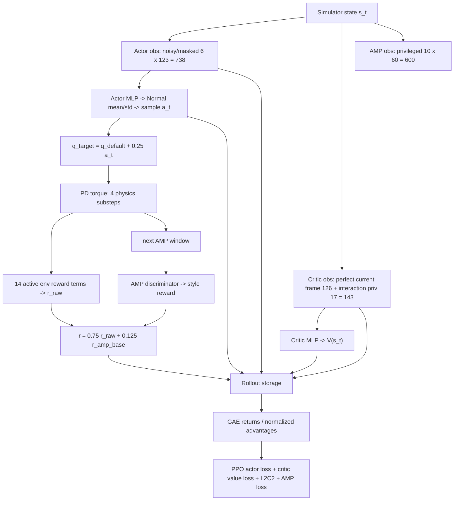

# PhysHSI CarryBox：Actor-Critic、Observation 与 Reward 全链路审计

## 0. 审计范围与结论

- 论文：**PhysHSI: Towards a Real-World Generalizable and Natural Humanoid-Scene Interaction System**，arXiv:2510.11072v1。
- 官方代码：`InternRobotics/PhysHSI` 的 `main`，远端与本地 `upstream/main` 均为提交 `07bf22bdaf9c23c1d40366334a744c1816b6d42b`。
- 当前本地分支：`main`，提交 `6ae564c`，远端为 `Ir1222/Carry_experiment`。
- 本文只分析注册名为 `carrybox` 的任务；`carrybox_boxperturb_*` 等实验变体不计入当前 reward 列表。

最重要的结论：

1. 当前 actor 输入是 **738-D = 6 帧 × 123-D**，不是论文文字所称的 5 帧历史。官方代码本身也是 6 帧，因此这是论文与公开实现的差异，不是本地新增差异。
2. 官方 critic 是 **126-D 单帧 privileged state**；当前本地 critic 是 **143-D**，即官方 126-D 再增加 17-D 物体速度、接触力和接触标志。这 17 维是当前 repo 的实验扩展，不在论文描述中。
3. critic **没有 actor 的 6 帧历史**。当前 critic 是单帧 143-D；actor 和 critic 是两个独立 MLP，没有共享 trunk。
4. AMP discriminator 是第三条独立支路，输入为 **600-D = 10 帧 × 60-D**。它既不是 actor observation，也不是 critic privileged observation。
5. 当前 active environment rewards 共 **14 项**：7 个 regularization、4 个原始 task composite、3 个本地 contact shaping；另有 AMP style reward。所有环境 reward scale 会先乘 `dt=0.02`。
6. 论文 Eq. (4) 写的是 log-style discriminator reward，但代码实际使用 least-squares discriminator 和二次型 style reward；论文表中的 `w^S=0.3` 也不等于代码的有效混合。

---

## 1. 先分清三类 observation

PhysHSI 代码中有三条不同的信息通道：

| 通道 | 当前维度 | 使用者 | 部署时是否需要 | 作用 |
|---|---:|---|---|---|
| actor observation `obs_buf` | 738 | policy actor | 是 | 产生 29-D action |
| critic observation `privileged_obs_buf` | 143 | PPO value critic | 否 | 估计 value、构造 advantage |
| AMP observation `amp_obs_buf` | 600 | discriminator | 否 | 产生 style reward、训练 discriminator |

这里最容易出现的概念错误，是把论文 Eq. (2) 的 discriminator privileged observation 当成 asymmetric actor-critic 的 critic observation。它们不是同一张量：

- `o_t^V`：给 PPO critic；当前代码是 143-D。
- `o_t^D`：给 AMP discriminator；当前代码每帧 60-D、窗口 10 帧。
- 两者都可以包含 simulator-only 信息，但消费它们的是两个不同网络，优化目标也不同。

---

## 2. Actor observation：738-D

### 2.1 论文定义

论文 Eq. (1) 定义单帧 proprioception：

$$
o_t^P = [\omega_{b_t},\; g_{b_t},\; \theta_t,\; \dot\theta_t,\; p^{ee}_{b_t},\; a_{t-1}] \in \mathbb{R}^{108}.
$$

CarryBox task observation 为：

$$
o_t^G=[b_t,\;p^o_{b_t},\;R^o_{b_t},\;p^g_{b_t}]\in\mathbb{R}^{15}.
$$

因此单帧总维度为 `108 + 15 = 123`。

论文正文写 `o^P_{t-4:t}` 和 `o^G_{t-4:t}`，对应 5 帧，理论维度应为 `5 × 123 = 615`。

### 2.2 当前代码的真实切片

当前代码配置为 `num_actor_history = 6`，所以：

$$
o_t^\pi=[x_{t-5},x_{t-4},\ldots,x_t]\in\mathbb{R}^{6\times123}=\mathbb{R}^{738}.
$$

每个 `x_t` 的切片如下：

| 单帧切片 | 维度 | 内容 | 处理 |
|---|---:|---|---|
| `[0:3]` | 3 | pelvis-frame angular velocity | 乘 `0.25`，加 uniform noise |
| `[3:6]` | 3 | projected gravity | 加 uniform noise |
| `[6:35]` | 29 | `q - q_default` | 加 uniform noise |
| `[35:64]` | 29 | joint velocity | 乘 `0.05`，加 uniform noise |
| `[64:79]` | 15 | 左/右手、左/右脚、头的 base-frame 位置 | 加 uniform FK noise |
| `[79:108]` | 29 | 上一 policy step 执行的 action | 无 observation noise |
| `[108:111]` | 3 | box position | coarse offset/noise/mask |
| `[111:117]` | 6 | box orientation 6D | coarse identity/noise/mask |
| `[117:120]` | 3 | box size | 无 task noise |
| `[120:123]` | 3 | goal position | 加 uniform noise |

注意任务项的**真实代码顺序**是：

$$
[p^o_{b_t},R^o_{b_t},b_t,p^g_{b_t}],
$$

而论文附录列举顺序是 `[b_t,p^o_{b_t},R^o_{b_t},p^g_{b_t}]`。维度相同，但部署端必须服从代码顺序，不能照论文列表直接拼接。

### 2.3 history 如何更新

代码每一步执行：

```text
old obs_buf[:, 123:]  +  current proprio[108]  +  current task[15]
```

即丢弃最老一帧，把当前 123-D 放在末尾。reset 时整个 actor history 清零，因此 episode 开始的前几步包含 zero padding。

### 2.4 actor 能看见与看不见什么

actor 能看见：带噪声的本体状态、FK end-effector、上一动作、可部署的 box/goal 表示。

actor 看不见：

- base linear velocity；
- 未 mask、无噪声的 box pose；
- box linear/angular velocity；
- hand/box contact forces；
- hand contact flags；
- domain-randomization 的真实参数。

当任务 success 时，代码把 actor 的 15-D task observation 全部写成 `-1`；critic task observation不做这个覆盖。

---

## 3. Asymmetric Actor-Critic：当前 critic 为 143-D

### 3.1 官方实现的 126-D critic

论文只给概念描述：actor 使用部署可得的 `o_t^\pi`，critic 使用更丰富的 `o_t^V`，例如 base velocity 和未 mask task observations。

官方代码把 critic 构造成一个**无历史、无噪声的当前帧**：

$$
o_{t,official}^V = [o_{t,noiseless}^P,\;v_{b_t},\;o_{t,perfect}^G]
\in\mathbb{R}^{108+3+15}=\mathbb{R}^{126}.
$$

其中：

- `o^P` 与 actor 单帧 proprioception 同构，但不加 observation noise；
- `v_b` 是 actor 看不到的 base linear velocity，乘 scale `2.0`；
- `o^G_perfect` 是 simulator truth box pose/size/goal，不经过 coarse localization、noise 或 mask。

### 3.2 当前 repo 新增的 17-D interaction privileged tail

当前本地代码在 126-D 后追加：

$$
z_t^{interaction}=[v^o_b,\omega^o_b,f^{lh}_b,f^{rh}_b,f^o_b,c^{lh},c^{rh}]
\in\mathbb{R}^{17}.
$$

因此：

$$
o_t^V=[o_{t,official}^V,z_t^{interaction}]\in\mathbb{R}^{143}.
$$

完整切片如下：

| critic 切片 | 维度 | 内容 | privileged 原因 |
|---|---:|---|---|
| `[0:108]` | 108 | 当前帧 noiseless proprioception | actor 对应量有噪声 |
| `[108:111]` | 3 | base linear velocity × 2 | actor 无此输入 |
| `[111:114]` | 3 | perfect box position | actor 输入可能 coarse/noisy/masked |
| `[114:120]` | 6 | perfect box orientation | 同上 |
| `[120:123]` | 3 | box size | actor 也有 |
| `[123:126]` | 3 | perfect goal position | actor goal 有噪声 |
| `[126:129]` | 3 | box linear velocity，base frame | simulator-only |
| `[129:132]` | 3 | box angular velocity，base frame | simulator-only |
| `[132:135]` | 3 | left-hand net contact force，base frame | simulator-only |
| `[135:138]` | 3 | right-hand net contact force，base frame | simulator-only |
| `[138:141]` | 3 | box net contact force，base frame | simulator-only |
| `[141]` | 1 | left contact flag，force norm > 1 N | simulator-only |
| `[142]` | 1 | right contact flag，force norm > 1 N | simulator-only |

17-D tail 的连续量先按配置 scale（当前均为 1），再 clip 到 `[-10,10]`。

### 3.3 privileged information 如何影响 actor

Actor MLP 与 critic MLP 不共享网络层：

$$
a_t\sim\pi_\theta(a|o_t^\pi),\qquad V_\phi(o_t^V).
$$

privileged observation 不会直接进入 actor forward。但它通过 value estimate 影响：

$$
\delta_t=r_t+\gamma V_\phi(o_{t+1}^V)-V_\phi(o_t^V),
$$

以及 GAE advantage，进而间接影响 PPO actor gradient。训练结束后只部署 actor，所以 deployment 不需要 143-D critic input。

### 3.4 这个本地扩展的含义与风险

收益：critic 更容易判断“箱子是否真的被双手稳定携带”，value target 的方差可能下降，尤其对稀疏的 pickup/carry phase 有帮助。

风险：

- contact force 未做运行时标准化，只是 clip；其尺度分布可能显著不同于其他 critic channel；
- critic 可能过度依赖 force/contact shortcut，导致 value 在 phase 边界过陡；
- 旧官方 checkpoint 的 critic 第一层输入为 126，不能直接载入当前 143-D critic；
- 17-D privileged tail 与新增 contact rewards 使用同一组物理信号，critic 对这些 shaping terms 几乎拥有“答案”，需要监测 explained variance、value loss 和 contact phase 的 value discontinuity。

---

## 4. AMP discriminator observation：600-D，不是 critic observation

### 4.1 当前实现

每帧 AMP observation 是：

$$
d_t=[h_t,\theta_t,p^{ee}_{b_t},\tilde p^o_{b_t},v_{b_t},\omega_{b_t},R^{root,6D}_t]
\in\mathbb{R}^{60}.
$$

切片：`1 + 29 + 15 + 3 + 3 + 3 + 6 = 60`。10 帧滑窗得到 600-D。

这里的 object position 会在水平距离超过 0.7 m 时被裁到半径 0.7 m，z 置零。这样 discriminator 主要区分 approach/pickup/carry/place phase，而不过度拟合远距离的绝对位置。

### 4.2 与论文 Eq. (2) 的差异

论文 Eq. (2)：

$$
o_t^D=[h_t,v_{b_t},\omega_{b_t},g_{b_t},\theta_t,p^{ee}_{b_t},p^o_{b_t}]\in\mathbb{R}^{57}.
$$

当前代码用 6-D heading-normalized root rotation 代替 3-D projected gravity，因此是 60-D 而不是 57-D。代码还计算了 `dof_vel`，但没有拼入 discriminator observation。

---

## 5. 当前 rewards 的精确组成

### 5.1 总体组合

环境先计算：

$$
r_t^{raw}=\Delta t\left(
\sum_i s_i r_i^{reg}+
\sum_j s_j r_j^{task}+
\sum_k s_k r_k^{contact}
\right),\qquad \Delta t=4\times0.005=0.02.
$$

`only_positive_rewards=False`，所以负 regularization/contact penalty 不会被截为零。

AMP 模块先产生：

$$
\hat r_t^{AMP}=\max\left(1-0.25(D(d_t)-1)^2,0\right).
$$

runner 又乘 `0.5`，随后 `amp_coef=0.25` 混合：

$$
r_t=0.25\cdot(0.5\hat r_t^{AMP})+0.75r_t^{raw}
=0.125\hat r_t^{AMP}+0.75r_t^{raw}.
$$

因此，不能把当前代码简单表述为论文的 `w^S=0.3, w^G=w^R=0.7`。

### 5.2 7 个 active regularization rewards

| 名称 | 函数 | 配置 scale | 乘 dt 后 scale |
|---|---|---:|---:|
| `dof_acc` | $\sum_j((\dot q^{prev}_j-\dot q_j)/\Delta t)^2$ | `-1e-7` | `-2e-9` |
| `action_rate` | $\sum_j(a^{prev}_j-a_j)^2$ | `-0.03` | `-6e-4` |
| `torques` | $\sum_j(\tau_j/K_{p,j})^2$ | `-1e-4` | `-2e-6` |
| `dof_vel` | $\sum_j\dot q_j^2$ | `-2e-4` | `-4e-6` |
| `dof_pos_limits` | joint-limit violation amount | `-5.0` | `-0.1` |
| `dof_vel_limits` | excess over soft velocity limit | `-1e-3` | `-2e-5` |
| `torque_limits` | excess over soft torque limit | `-0.03` | `-6e-4` |

论文 Table VI 的 torque-limit weight 是 `-0.1`，官方代码与当前代码均为 `-0.03`。其他六项与表格一致。

### 5.3 4 个 active task composite rewards

以下公式省略最外层 `dt × scale`；四个 outer scale 分别为 `1,1,1,0.2`。

#### A. `walk_task`：对应论文 Eq. (8)

配置中 position term 权重为 0，所以实际为：

$$
r_t^{walk}=
\exp[-5(0.85-v_{robot\to box})^2]
+0.5\exp[-0.75|\Delta\psi_{box}|].
$$

当 robot-box 距离小于 0.7 m 时直接置为最大值 `1.5`。这一项与论文 `r_t^{loco}` 基本一致。

#### B. `carryup_task`：论文 Eq. (10) 的 hand term + Eq. (11)

$$
r_t^{carryup}=0.7\exp[-3\|\bar p^{hand}-p^o\|^2]
+2\exp[-3\max(0,0.72-p_z^o)].
$$

robot-box 距离大于 0.7 m 时为 0。与论文相比：

- 代码 lift target 是 `0.72 m`，论文 Eq. (11) 是 `0.75 m`；
- 代码对高于目标的 box 直接饱和，不惩罚过高；
- 论文把 hand alignment 写在 `r_carry`，代码把它并入 `carryup_task`，但只要 robot 与 box 保持接近，它在 carry 阶段仍持续生效。

#### C. `relocation_task`：对应论文 Eq. (10) 与 Eq. (12)

当前非零内部项为：

$$
\begin{aligned}
r_t^{reloc}={}&0.5e^{-0.75|\Delta\psi_{goal}|}
+e^{-5(0.85-v_{robot\to goal})^2}\\
&+e^{-10\|p^o-p^g\|}
+\mathbf{1}[\|p^o_{xy}-p^g_{xy}\|\le0.6]e^{-3|p_z^o-p_z^g|}.
\end{aligned}
$$

只有满足以下任一条件才启用：box bottom 高出 source platform 超过 0.05 m，或 box 已离开初始位置超过 0.5 m。

与论文的主要差异：

- 论文 Eq. (12) 以 robot-goal 距离 0.7 m 做 stage gate；代码的 put-height term 以 object-goal XY 距离 0.6 m gate；
- 论文高度项写成 `exp(-3(p_z^o-p_z^g))`，代码使用绝对值；
- 代码在 object-goal 3D 距离小于 0.05 m 时把整个 composite 置为最大 `3.5`。

#### D. `standup_task`：论文 Eq. (13) 之外的 post-success shaping

只有 `success_buf=True` 时启用：

$$
r_t^{standup}=0.2\left[
0.5r_{head\ height}+1.0r_{stand\ still}+0.5r_{hands\ free}
\right].
$$

其中 base-height 内部项虽然被计算，但配置权重为 0。该 composite 不在论文 CarryBox 的

$$r_t^{G-carryBox}=r_t^{loco}+r_t^{carry}+r_t^{pick}+r_t^{put}$$

表达式中，是代码额外的成功后姿态 shaping。

### 5.4 当前 repo 新增的 3 个 contact rewards

先定义 `carry_phase`：

- box bottom 相对 source support clearance > 0.05 m；
- `||v_box-v_robot|| < 1.0 m/s`；
- `||ω_box|| < 3.0 rad/s`。

注意 `carry_phase` 本身不要求手接触。

1. `bimanual_contact`，scale `+0.35`：

$$r^{bi}=\mathbf{1}[carry\_phase]\mathbf{1}[c_L\land c_R].$$

2. `single_hand_contact`，scale `+0.05`：

$$r^{single}=\mathbf{1}[carry\_phase]\mathbf{1}[c_L\oplus c_R].$$

3. `hand_box_relative_motion`，scale `-0.15`：仅对正在接触的手，令

$$
P(v)=\mathrm{clip}\left(\frac{v-0.35}{1.20-0.35},0,1\right)^2,
$$

对接触手取平均。只有 lifted 且至少一只手接触时生效。

这三项在官方 main 不存在，是当前 repo 的明确扩展。它们会通过 `r_raw` 进入 PPO，并与新增 17-D critic privileged tail 形成同一交互状态的“reward + value information”双重强化。

### 5.5 L2C2 不是 environment reward

论文把 L2C2 描述为 smoothness regularization。代码中它不是 `rew_buf` 的一项，而是在 PPO update 内直接加入优化 loss：

$$
L=L_{PPO}+c_VL_V-c_HH+L_{policy\ smooth}+L_{value\ smooth}+L_{AMP}.
$$

代码在相邻 observation 之间随机插值，惩罚 actor mean action 与 critic value 的变化。因此日志中的 episode reward 不包含 L2C2。

---

## 6. 从环境到 PPO 的完整传递流程



按代码执行顺序展开：

1. runner 持有 `obs_t` 和 `critic_obs_t`。
2. `HIMPPO.act`：actor 用 738-D 采样 action；critic 用 143-D 计算 value；两者连同 log-prob 存入 transition。
3. `env.step(action)`：action clip 后，经 `action_scale=0.25` 变成 joint-position offset；PD controller 在 4 个 0.005 s physics steps 上执行。
4. `post_physics_step` 刷新 simulator tensors，计算 base/FK/object/contact quantities。
5. 更新 carry phase，检查 termination，然后计算 14 项 raw rewards。
6. 计算终止前 AMP observation。
7. 对 done env，在 reset 前构造 143-D `termination_privileged_obs`；随后 reset，并生成 reset 后的 next actor/critic observations。
8. runner 用 termination critic observation 替换 done env 的 next critic observation，避免 L2C2 插值跨越 reset 边界。
9. AMP 根据 600-D window 产生 style reward；与 raw reward 混合。
10. transition 进入 rollout storage；rollout 完成后用 critic values 计算 GAE/returns。
11. PPO minibatch 中，738-D 只进入 actor，143-D 只进入 critic，600-D 只进入 AMP discriminator。

---

## 7. 论文、官方 main、当前 repo 对照表

| 项目 | 论文 | 官方 main | 当前 repo | 审计判断 |
|---|---|---|---|---|
| actor history | 5 帧 | 6 帧 | 6 帧 | paper-code mismatch |
| actor input | 理论 615-D | 738-D | 738-D | 当前沿用官方 |
| task obs 顺序 | shape, pos, rot, goal | pos, rot, shape, goal | 同官方 | 部署按代码 |
| critic | richer state，未给精确维度 | 126-D | 143-D | 本地新增 17-D |
| critic history | 未说明 | 单帧 | 单帧 | 明确不是 738/758-D history critic |
| AMP per-frame obs | 57-D | 60-D | 60-D | gravity 3D 被 root rotation 6D 替代 |
| AMP window | clip notation | 10 帧/600-D | 同官方 | 一致 |
| style reward | `-log(1-D)` | quadratic LS reward | 同官方 | paper-code mismatch |
| style coefficient | 一般 `0.3` | effective max coefficient `0.125` | 同官方 | 不能直接等同 |
| torque-limit scale | `-0.1` | `-0.03` | `-0.03` | paper-code mismatch |
| task reward | Eq. (8)-(13) | 4 composites + standup shaping | 同官方 | 公式被重组且阈值略变 |
| contact rewards | 无 | 无 | 3 项 | 本地扩展 |
| interaction critic priv | 无 | 无 | 17-D | 本地扩展 |

---

## 8. 工程建议

1. **把 observation schema 固化成单一常量或 dataclass。** 当前维度靠手工算式和切片维持，论文顺序与代码顺序已不一致。至少应给 actor、critic、AMP 各自定义 named slices，并在 deployment 复用。
2. **明确实验命名。** 当前 `carrybox` 已不是官方 baseline，建议实验名标注 `critic143_contactreward`，避免 checkpoint 与 126-D baseline 混淆。
3. **做三组必要 ablation。** `126-D baseline`、`143-D critic only`、`143-D + contact rewards`。否则无法判断收益来自 privileged critic，还是 reward shaping。
4. **监控 critic shortcut。** 分 carry phase 记录 explained variance/value error；对 force tail 做 zero-out evaluation，观察 return/value 偏差。
5. **考虑 force normalization。** 当前 force/velocity 全部 scale 1、clip 10。建议先统计 p50/p95/p99，再决定固定 scale 或 running normalization。
6. **记录 reward 的 pre-dt、post-dt、post-AMP 三层值。** 当前 TensorBoard 的 raw/style/combined 总量尺度不直观，容易误判 `amp_coef` 的实际影响。
7. **论文复现时不要仅对齐公式名称。** 需要同时固定：6 帧 actor history、task slice 顺序、60×10 AMP input、LS discriminator、0.5 runner factor、dt-scaled raw reward 和代码阈值。

---

## 9. 关键代码位置

- actor/critic 维度与 reward scales：`legged_gym/legged_gym/envs/g1/carrybox_config.py`
- task observation、actor history、143-D critic：`legged_gym/legged_gym/envs/g1/carrybox.py:712-953`
- AMP observation：`legged_gym/legged_gym/envs/g1/carrybox.py:192-222`
- reward 调度与 dt scaling：`legged_gym/legged_gym/envs/g1/carrybox.py:685-710,1835-1858`
- reward implementations：`legged_gym/legged_gym/envs/g1/carrybox.py:2327-2740`
- actor/critic MLP：`rsl_rl/rsl_rl/modules/actor_critic.py:92-195`
- AMP loss/reward/mix：`rsl_rl/rsl_rl/modules/amp.py:23-131`
- rollout 主循环：`rsl_rl/rsl_rl/runners/him_on_policy_runner.py:121-214`
- PPO 与 L2C2：`rsl_rl/rsl_rl/algorithms/him_ppo.py:145-268`
- GAE/storage：`rsl_rl/rsl_rl/storage/him_rollout_storage.py:92-180`

## 10. 验证记录

- 远端 `InternRobotics/PhysHSI main` 已通过 `git ls-remote` 验证为 `07bf22bd...`，与本地 `upstream/main` 一致。
- 对 7 个核心 Python 文件执行了内存语法编译，全部通过。
- repo 自带 `validate_carrybox_phase_a.py` 对 738-D actor、126-D critic base、17-D interaction tail、143-D critic 和 terminal critic observation 均有 runtime assertions；本次审计未启动 Isaac Gym/GPU simulation。

